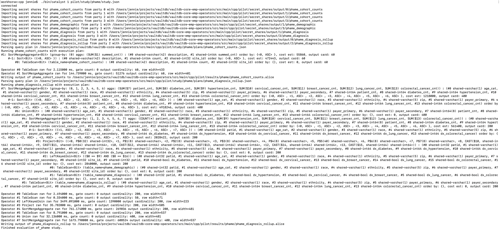

# Catalyst PHAME Workflow 

This document described the tables each data partner will contribute to the Catalyst study.  This study will reproduce and extend the [PHAME](https://phame.uic.edu) study at UIC.  

There are two types of data partners participating in this study.  They are:
* Row-level: These sites will contribute patient-level data that we will aggregate within MPC.
* Aggregate-level: They contribute partially aggregated data that we will include in our analysis.

We detail the input tables from each data partner how we're going to compute over them in MPC below. 

Caveats: for now treating all counts as `int64`s for simplicity.  I am sure there are more to come here.

## Population-Level Statistics

All sites will contribute the following population-level statistics:
* Total Unique Patients at Site
* Total Unique Patients before Randomization
* Total Unique Patients after Randomization
* Female - Age between 18-30
* Male - Age between 18-30
* Female - Age between 31-40
* Male - Age between 31-40
* Female - Age between 41-50
* Male - Age between 41-50
* Female - Age between 51-60
* Male - Age between 51-60
* Female - Age between 61-70
* Male - Age between 61-70
* Female - Age > 70
* Male - Age > 70

These inputs will arrive sorted in this order and we will take the simple sum over all sites.

All of our other statistics pertain only to participants who are in the randomly selected cohort. 

**Table name**: `phame_cohort_counts`\
**Schema**: `(desc:varchar(42), count:int64, site_id:int32)`\
**Filename**: `phame_cohort_counts.csv`\
**Study table**: A1\
**Partners**: all

## Demographics

We start with patient-level demographic data (aka the denominator).  Demographic variables in inputdata are coded as follows:
* `age_cat` $\in [0, 6]$
* `gender` $\in$ {M, F, N, 0}
* `race` $\in [0, 9]$
* `ethnicity` $\in [0, 6]$
* `zip_code` (5-digit string)
* `payer_primary` $\in [0, 6]$
* `payer_secondary`  $\in [0, 6]$


We'll join this with `phame_diagnosis` later to get the rollup under MPC.

**Table name**: `phame_demographic`\
**Schema**: `(patid:int32, age_cat:char(1), gender:char(1), race:char(1), ethnicity:char(1), zip:char(5), payer_primary:char(1), payer_secondary:char(1))`\
**Filename**: `phame_demographic.csv`\
**Study table**: B1\
**Partners**: row-level

With this table we will aggregate over individuals who meet the study criteria of having one admit date within the study period.  These individuals are all over the age of 18 and within the Chicago-area zip codes in the study (`study_population` in the protocol).

Participants also needed a `cap_id` to qualify for the denominator.  We are not completing that part because we are not doing PPRL in this first round.

This table stratifies by zip code and gives overall statistics of the sample.  We will add these up for each zip over all sites.  

This table is a bit tricky because it seems to partition by race and ethnicity interchangably as if they will add up to the total when ethnicity and race are modeled in the CDM as independent variables. 

We may want to include a preprocessing step that pads the secret shares so that all of the zip codes are covered.  Thus we could just concatenate the partial counts one line at a time and add them up.  Otherwise we sort and sum the partial counts.

**We will likely need to append the site_id from `cohort_counts` to this table to join it with `diagnosis`.*


## Diagnosis

This is the numerator for the study.

**Table name**: `phame_diagnosis`\
**Schema**: `(patid:int32, dx_diabetes:bool, dx_hypertension:bool, dx_cervical_cancer:bool, dx_breast_cancer:bool, dx_lung_cancer:bool, dx_colorectal_cancer:bool)`\
**Filename**: `phame_diagnosis.csv`\
**Study table**: B2\
**Partners**: row-level

**We will likely need to append the site_id from `cohort_counts` to this table to join it with `demographic`.*

### Diagnosis Rollup

We will sum the counts of each diagnosis over all sites. This is stratified by all of the demographic variables coded as in the [denominator](#demographics) table.

**Table name**: `phame_diagnosis_rollup`\
**Schema**: `(age_cat:char(1), gender:char(1), race:char(1), ethnicity:char(1), zip:char(5), payer_primary:char(1), payer_secondary:char(1), patient_cnt:int64, diabetes_cnt:int64, hypertension_cnt:int64, cervical_cancer_cnt:int64, breast_cancer_cnt:int64, lung_cancer_cnt:int64, colorectal_cancer_cnt:int64)`\
**Filename**: `phame_diagnosis_rollup.csv`\
Study table: N/A, this will take the place of the B5-B16 tables\
**Partners**: all


## JSON Study Parameters 

A study will need to be defined in a JSON file.  This will include the following parameters:
* Table names and schemas
* Name of a second JSON with the SQL code.
* Specify which data partners will contribute to each table.

Example JSON:
```json
{
  "name": "phame",
  "protocol": "sh2pc",
  "alice_host":  "127.0.0.1",
  "port": "65432",
  "note": "all paths are relative to $VAULTDB_ROOT/src/main/cpp",
  "secret_shares_path": "pilot/secret_shares/output",
  "query_path": "pilot/study/phame/plans",
  "dst_path": "pilot/results/phame",
  "min_cell_count": 11,
  "tables": [
    {
      "name": "phame_cohort_counts",
      "schema": "(description:varchar(42), count:int64, site_id:int32)",
      "input_parties": [0, 1, 2, 3]
    },
    {
      "name": "phame_demographic",
      "schema": "(patid:int32, age_cat:char(1), gender:char(1), race:char(1), ethnicity:char(1), zip:char(5), payer_primary:char(1), payer_secondary:char(1), site_id:int32)",
      "input_parties": [1, 3]
    },
    {
      "name": "phame_diagnosis",
      "schema": "(patid:int32, dx_diabetes:bool, dx_hypertension:bool, dx_cervical_cancer:bool, dx_breast_cancer:bool, dx_lung_cancer:bool, dx_colorectal_cancer:bool, site_id:int32)",
      "input_parties": [1, 3]
    },
    {
      "name": "phame_diagnosis_rollup",
      "schema": "(age_cat:char(1), gender:char(1), race:char(1), ethnicity:char(1), zip:char(5), payer_primary:char(1), payer_secondary:char(1), patient_cnt:int64, diabetes_cnt:int64, hypertension_cnt:int64, cervical_cancer_cnt:int64, breast_cancer_cnt:int64, lung_cancer_cnt:int64, colorectal_cancer_cnt:int64)",
      "input_parties": [0, 2]
    }
  ],
  "queries": [
    {
      "name": "phame_cohort_counts",
      "count_cols": [1],
      "note": "count cols are zero-indexed.  This denotes the cells we will redact when they have vals < min_cell_count"
    },
    {
      "name": "phame_diagnosis_rollup",
      "count_cols": [7, 8, 9, 10, 11, 12, 13]
    }
  ]
}
```

### Input Tables
The secret shares are stored in the directory specified in `secret_shares_path`.  The alice and bob shares need to have different names so that we can test this efficiently on a single machine.
Implicitly each input table is the union of all secret shares in the file.  Each table entry has three parts:
* Name: this tells the system where to look for the secret shares.
* Schema: defines the column names and their types.
* Input parties: this tells the system which parties will contribute to this table.

Each party's secret shares are stored in a subdirectory named after the party.  The secret shares are stored in files named after the table.  The filenames are the party's name followed by the table name with the computing party as the suffix.  We have the suffixes `.alice` and `.bob`.  We can change this if we want to test with more parties, but I am resisting the temptation to make the suffixes ".0" and ".1" because it is easy to conflate with the party IDs.

For example, the `phame_demographic` table for Party 0 will have Alice's secret shares stored in: `$SECRET_SHARES_PATH/0/phame_demographic.alice`.  

### Query Files

For each output table we will need a JSON file for the SQL statement.  This will query against the database we defined in the tables section of the JSON file.  We could eventually just make this take in a SQL statement and have the config parser run the [Calcite](https://calcite.apache.org) SQL statement parser (that writes the query execution plan JSON) on the specified file.  But for now we'll just pre-generate these. 

The `query_path` is the directory where we store one JSON file per SQL statement.  The `dst_path` denotes the directory where the output of a query will be stored as secret shares.

Each query specification has:
* Name: this tells the system where to look for the JSON file that specifies the query logic.
* Count cols: this is a list of the zero-indexed column numbers that we will sum over. 


The `queries` list has the SQL-to-JSON files that we will read and execute.  For example, Alice will first run the query specified in:\
`$QUERY_PATH/phame_cohort_counts.json`

We will then redact the summed patient counts in the second column of the output table under MPC.  We loop over the specified columns and if their secret-shared value is less than `min_cell_count`, we replace it with -1. 

After that, each computing party will write its XOR-able secret shares to:\
`$DST_PATH/phame_cohort_counts.(alice|bob)`

The latter will be sent to the investigator once we are done the study. This will work similarly for the `phame_diagnosis_rollup` table and for Bob's shares.

## Testing the Pipeline

To try out this pipeline, start from `$VAULTDB_ROOT/src/main/cpp`.  To generate synthetic PHAME data, run:
```bash 
bash pilot/test/generate-and-load-phame-test-data.sh 4 100
```

Right now this is configured for 4 hosts, 100 rows generated per host.  You can change the rows per host to try scaling up or down but the data loading is only configured for 4 hosts for now.  Since this is all a simulated pipeline, I am not going to add infra for varying the number of hosts unless we need it.  

In this test, we have parties (0, 2) as aggregate-only data partners and (1, 3) are row-level ones.  This is congruent with what we have in the sample json file.

To run the pipeline on a single host, run:
```bash
#alice
./bin/catalyst 1 pilot/study/phame/study.json  &
#bob
./bin/catalyst 2 pilot/study/phame/study.json 
```

The output should look similar to:


